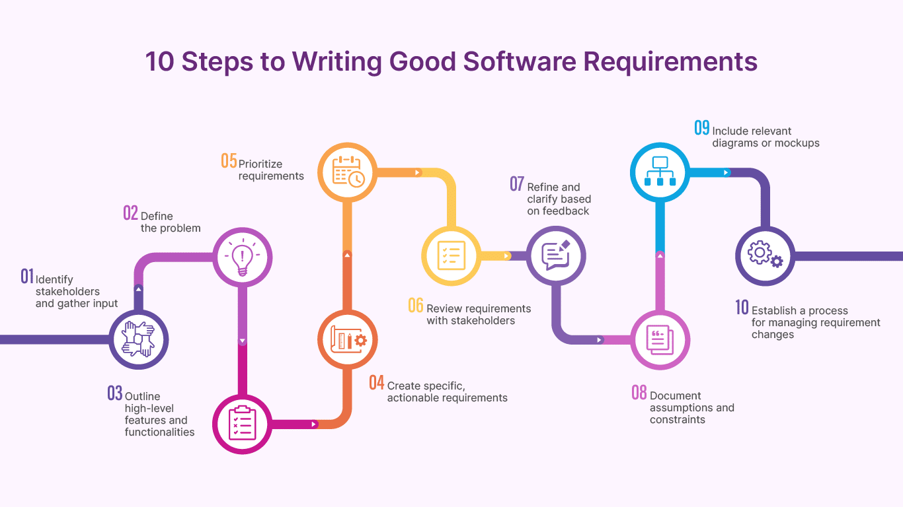
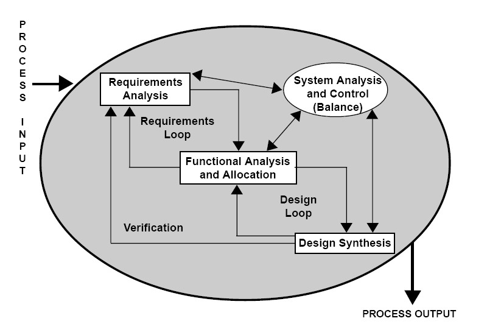

# Digital Loan Approval Platform (MVP)

## Problem Statement
Manual loan approval is slow, inconsistent, and error-prone. Banks require
a system that can automatically evaluate loan applications using predefined
business rules and credit data.

## Business Goal
- Reduce loan approval time from days to seconds
- Minimize manual intervention
- Improve decision consistency
- Enable auditability of decisions

## In Scope
- User loan application
- Automated eligibility checks
- Manual review for edge cases
- Loan decision dashboard

## Out of Scope
- Loan disbursement
- KYC document storage
- Third-party fraud detection (future phase)

#Additional:

##1️⃣ Requirement Analysis

Owner: Business Analyst
What they do (actual work):

Talk to bank managers

Ask: “What rules decide loan approval?”

Convert legal + business rules into logic

Example requirement

If credit score > 750 → auto approve

If income < ₹25,000 → reject

Manual review for edge cases

##📄 Output:

SRS document

User stories like:

“As a loan officer, I want to see flagged applications…”

