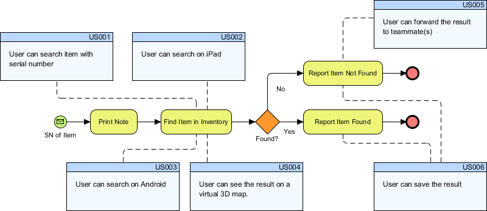

###1️⃣ Requirement Analysis

Owner: Business Analyst
What they do (actual work):

Talk to bank managers

Ask: “What rules decide loan approval?”

Convert legal + business rules into logic

Example requirement

If credit score > 750 → auto approve

If income < ₹25,000 → reject

Manual review for edge cases

📄 Output:

SRS document

User stories like:

“As a loan officer, I want to see flagged applications…”

