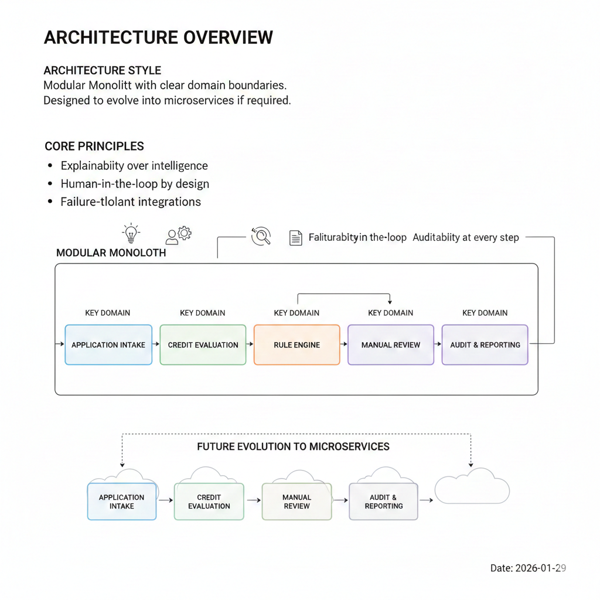

# Architecture Overview

## Architecture Style
Modular Monolith with clear domain boundaries.
Designed to evolve into microservices if required.

## Core Principles
- Explainability over intelligence
- Human-in-the-loop by design
- Failure-tolerant integrations
- Auditability at every step

## Key Domains
- Application Intake
- Credit Evaluation
- Rule Engine
- Manual Review
- Audit & Reporting
